### How to enable Replication on two S3 buckets in the same AWS Account

Amazon Simple Storage Service (S3) provides a feature called "replication" that allows users to automatically replicate data from one S3 bucket to another within the same region or to a different region.

The process of replication can be triggered by specific events such as object creation, deletion or updates.

There are two types of replication:

1. S3 Bucket Replication: this type of replication allows users to replicate objects within the same AWS region or to a different region.

2. Cross-Region Replication (CRR): this type of replication enables users to replicate data to a different region, which can be useful for disaster recovery or compliance with regional data residency requirements.

To enable replication, you will need to create a replication rule in the source bucket that specifies which objects should be replicated and where they should be replicated to. The destination bucket must also have a proper IAM role configured to receive the replicated data.

S3 replication also provides options for data encryption, versioning and also Multi-Factor Authentication (MFA) Delete that enables additional level of security.

It's important to note that S3 replication only replicates new or updated objects, it doesn't replicate deletions. If deletion of an object needs to be replicated , it can be achieved via versioning in the source bucket.

#### Enabling S3 Replication using the AWS Management Console:

- Step One - Create two buckets with policies that block all public access and versioning enabled. First, open the S3 Console;

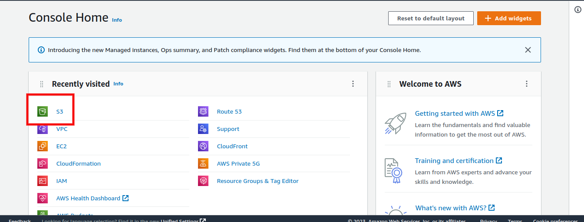

1. Select **Create bucket**; 

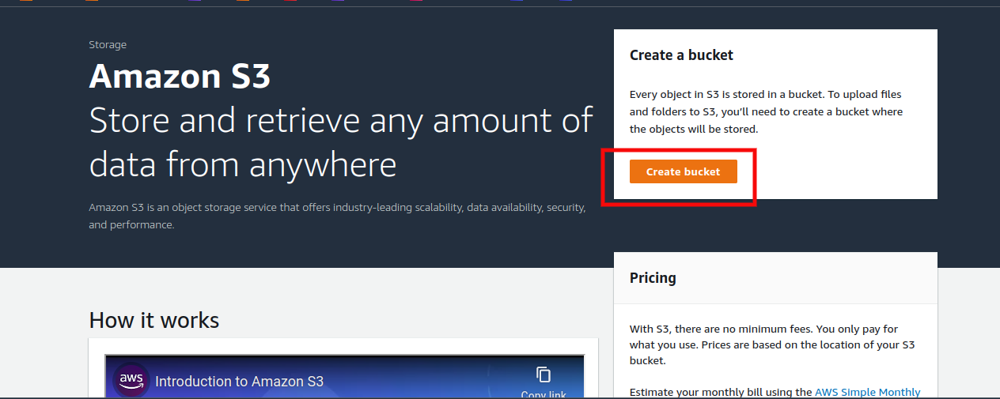

2. Enter a **name** for your "Source" bucket and select the **region** where you want the bucket to reside;

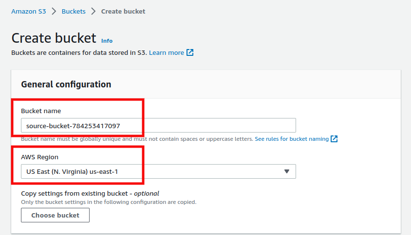

3. In **Block Public Access settings for this bucket**, ensure the **Block all public access** is enabled to make the bucket and its content private; 

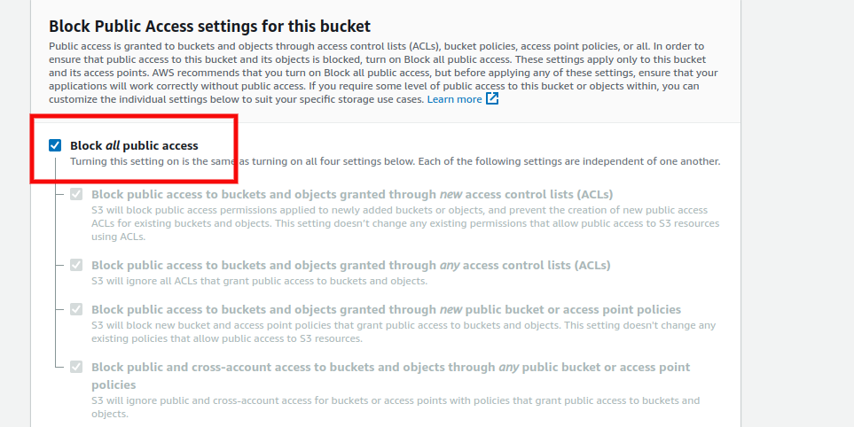

4. For the purpose of replication configuration on S3 buckets, **Bucket Versioning** needs to be **enabled**, as illustrated;

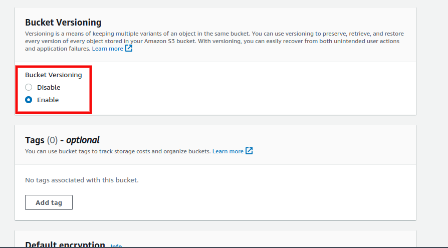

5. Then click **Create bucket**;

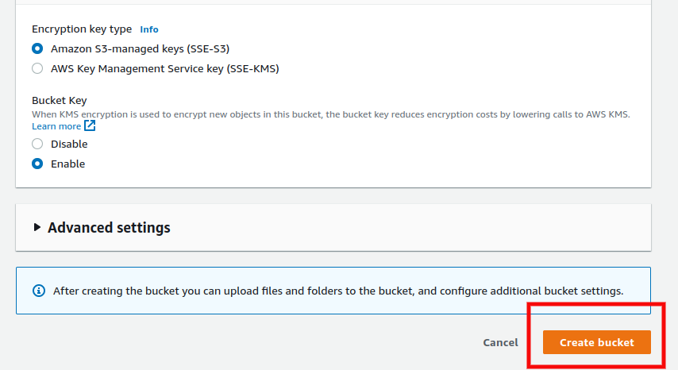

6. Repeat the previous steps (1 - 5) to create a "Destination" bucket. Notice the buckets created are not public;

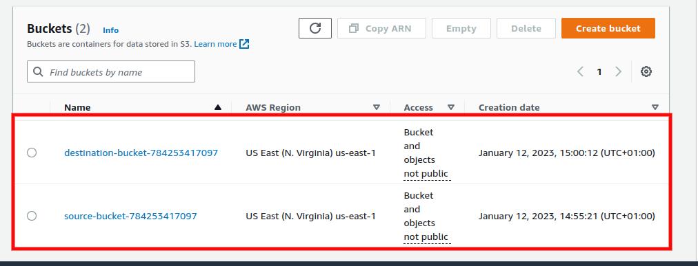

- Step Two - Create a Replication Rule in the Source bucket with an IAM Role that Amazon S3 can assume to replicate objects on your behalf. First, click the **Name** of the Source bucket;

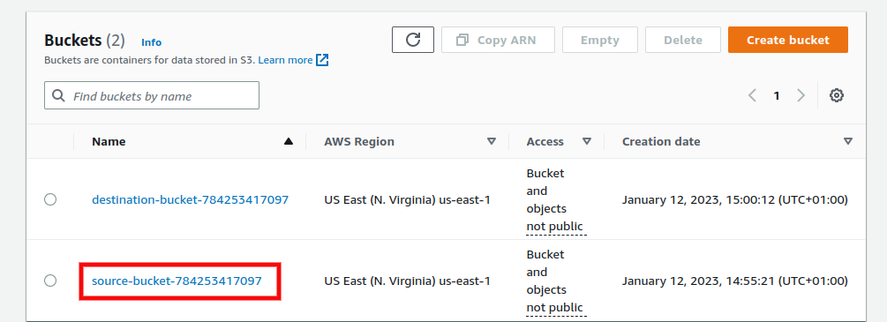

1. On the Source bucket's page, click the **Management** tab;

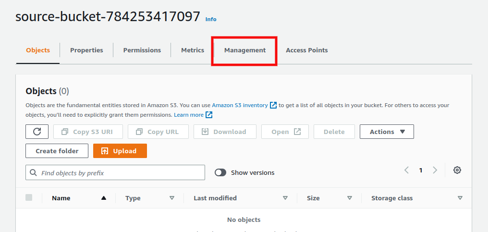

2. Under the **Management** tab, click **Create replication rule**;

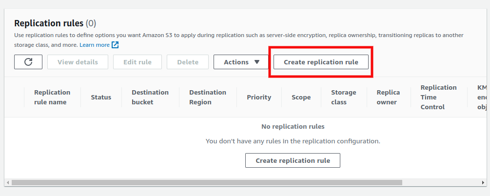

3. Enter a **Replication rule name** and ensure the **Status** is set to **Enabled**;

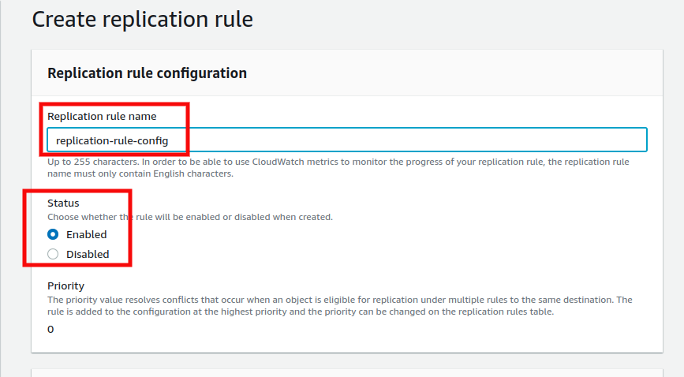

4. The **Source bucket name** and **Source Region** will be preselected. Select the option **Apply to all objects in the bucket** under **Choose a rule scope**, so all items in the source bucket will be replicated to the destination bucket;

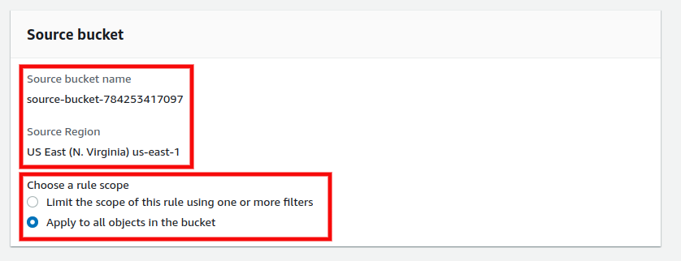

5. Under **Destination**, click **Browse S3**;

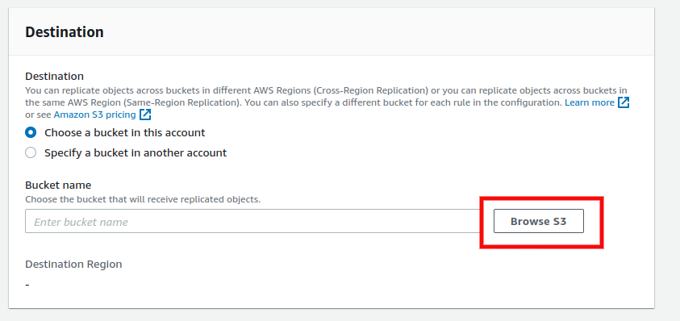

6. In the **Choose a bucket** window, select the destination bucket you created earlier and click **Choose path**;

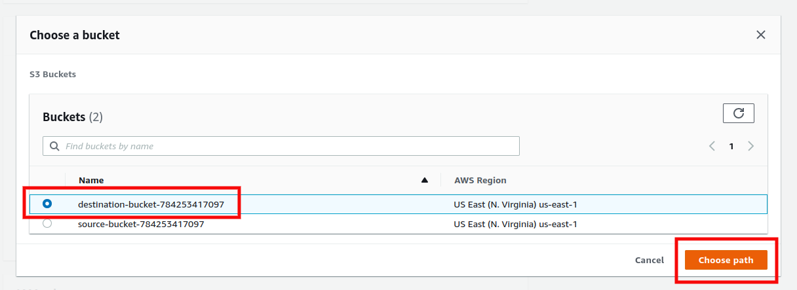

7. Under **IAM role**, select **Choose from existing IAM roles** and select **Create new role** from the IAM role drop-down list;

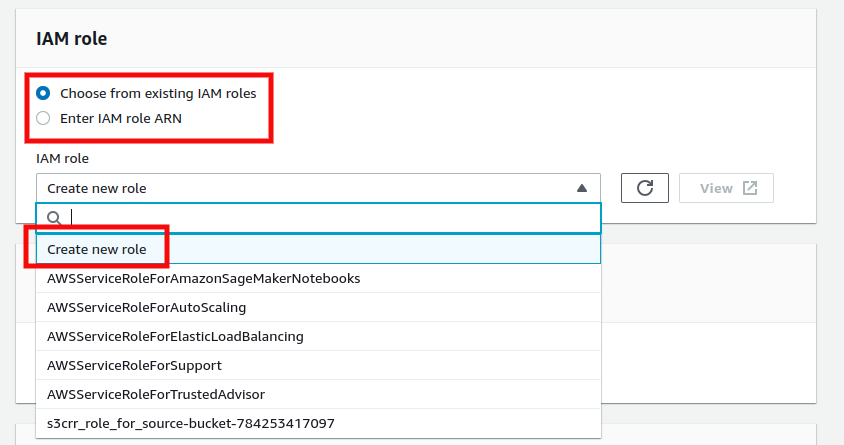

8. For **Additional replication options**, select **Delete marker replication**. This ensures that objects deleted in the source bucket are also deleted in the destination bucket. However, you can leave it unchecked if you want to keep replicated objects in the destination bucket even after the objects have been deleted in the source bucket. Then click **Save**;

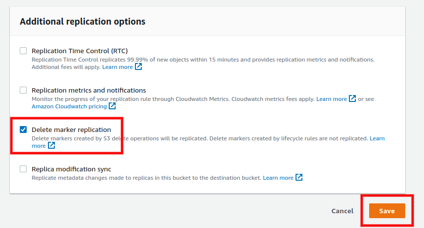

9. You can choose to replicate existing objects in the source bucket by selecting **Yes, replicate existing objects.** or choose not to by selecting **No, do not replicate existing objects.** and then click **Submit**;

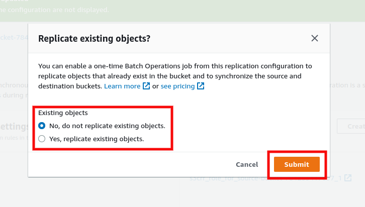

10. At this point, you will notice the **Replication rule** and **IAM role** have been successfully configured in the **Source bucket**. 

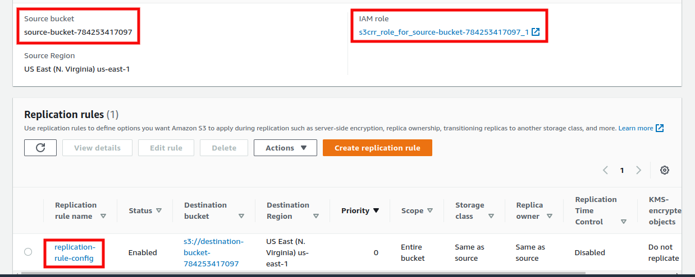

#### Enabling S3 Replication using the AWS CloudFormation:

1. Create a source bucket and enable versioning on it. The following code creates a source bucket that blocks all public access;

        SourceBucket:
          Type: AWS::S3::Bucket
          Properties:
            BucketName: "source-bucket-784253417097"
            VersioningConfiguration:
              Status: Enabled
            PublicAccessBlockConfiguration:
              BlockPublicAcls: true
              BlockPublicPolicy: true
              IgnorePublicAcls: true
              RestrictPublicBuckets: true

2. Create a destination bucket and enable versioning on it. The following code creates a destination bucket that blocks all public access;

        DestinationBucket:
          Type: AWS::S3::Bucket
          Properties:
            BucketName: "destination-bucket-784253417097"
            VersioningConfiguration:
              Status: Enabled
            PublicAccessBlockConfiguration:
              BlockPublicAcls: true
              BlockPublicPolicy: true
              IgnorePublicAcls: true
              RestrictPublicBuckets: true

3. Create an IAM role. You specify this role in the replication configuration that you add to the source bucket later. Amazon S3 assumes this role to replicate objects on your behalf. The following code creates a role that grants Amazon S3 service principal permissions to assume the role; 

        ReplicationRole:
          Type: "AWS::IAM::Role"
          Properties:
            AssumeRolePolicyDocument:
              Statement:
                - Action:
                    - "sts:AssumeRole"
                  Effect: Allow
                  Principal:
                    Service:
                      - s3.amazonaws.com

4. Create a policy that grants permissions for S3 replication to the **ReplicationRole**;

        ReplicationPolicy:
          Type: 'AWS::IAM::Policy'
          Properties:
            PolicyDocument:
              Statement:
                - Action:
                    - 's3:GetReplicationConfiguration'
                    - 's3:ListBucket'
                  Effect: Allow
                  Resource:
                    - !Join
                      - ''
                      - - 'arn:aws:s3:::source-bucket-784253417097'
                - Action:
                    - 's3:GetObjectVersion'
                    - 's3:GetObjectVersionAcl'
                  Effect: Allow
                  Resource:
                    - !Join
                      - ''
                      - - 'arn:aws:s3:::source-bucket-784253417097/*'
                - Action:
                    - 's3:ReplicateObject'
                    - 's3:ReplicateDelete'
                  Effect: Allow
                  Resource:
                    - !Join
                      - ''
                      - - 'arn:aws:s3:::destination-bucket-784253417097/*'
            PolicyName: ReplicationPolicy
            Roles:
              - !Ref ReplicationRole

5. Add replication configuration to the source bucket;

        ReplicationConfiguration:
          Role: !GetAtt "ReplicationRole.Arn"
          Rules:
            - Destination:
                Bucket: 'arn:aws:s3:::destination-bucket-784253417097'
                StorageClass: STANDARD
              Id: ReplicationConfig
              Prefix: ''
              Status: Enabled

The final cloudformation script should look like this;

        ---
        AWSTemplateFormatVersion: "2010-09-09"
        Description: >
          Enabling Replication on two S3 buckets in the same AWS Account

        Resources:
          SourceBucket:
            Type: AWS::S3::Bucket
            Properties:
              BucketName: "source-bucket-784253417097"
              VersioningConfiguration:
                Status: Enabled
              PublicAccessBlockConfiguration:
                BlockPublicAcls: true
                BlockPublicPolicy: true
                IgnorePublicAcls: true
                RestrictPublicBuckets: true
              ReplicationConfiguration:
                Role: !GetAtt "ReplicationRole.Arn"
                Rules:
                  - Destination:
                      Bucket: "arn:aws:s3:::destination-bucket-784253417097"
                      StorageClass: STANDARD
                    Id: ReplicationConfig
                    Prefix: ""
                    Status: Enabled

          DestinationBucket:
            Type: AWS::S3::Bucket
            Properties:
              BucketName: "destination-bucket-784253417097"
              VersioningConfiguration:
                Status: Enabled
              PublicAccessBlockConfiguration:
                BlockPublicAcls: true
                BlockPublicPolicy: true
                IgnorePublicAcls: true
                RestrictPublicBuckets: true

          ReplicationPolicy:
            Type: "AWS::IAM::Policy"
            Properties:
              PolicyDocument:
                Statement:
                  - Action:
                      - "s3:GetReplicationConfiguration"
                      - "s3:ListBucket"
                    Effect: Allow
                    Resource:
                      - !Join
                        - ""
                        - - "arn:aws:s3:::source-bucket-784253417097"
                  - Action:
                      - "s3:GetObjectVersion"
                      - "s3:GetObjectVersionAcl"
                    Effect: Allow
                    Resource:
                      - !Join
                        - ""
                        - - "arn:aws:s3:::source-bucket-784253417097/*"
                  - Action:
                      - "s3:ReplicateObject"
                      - "s3:ReplicateDelete"
                    Effect: Allow
                    Resource:
                      - !Join
                        - ""
                        - - "arn:aws:s3:::destination-bucket-784253417097/*"
              PolicyName: ReplicationPolicy
              Roles:
                - !Ref ReplicationRole

          ReplicationRole:
            Type: "AWS::IAM::Role"
            Properties:
              AssumeRolePolicyDocument:
                Statement:
                  - Action:
                      - "sts:AssumeRole"
                    Effect: Allow
                    Principal:
                      Service:
                        - s3.amazonaws.com

5. Execute the cloudformation script using the following command;

        aws cloudformation create-stack/update-stack
            --stack-name STACK_NAME
            --template-body FILE_NAME/TEMPLATE_URL
            --parameters PARAMETER_NAME=PARAMETER_VALUE
            --capabilities CAPABILITY

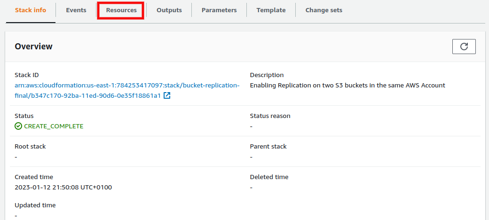

6. Head over to the AWS Management Console then navigate to the CloudFormation console and confirm that the script has been executed successfully. Click on **Resources**. This will display a list of the resources deployed based on what was declared in the Cloudformation script;

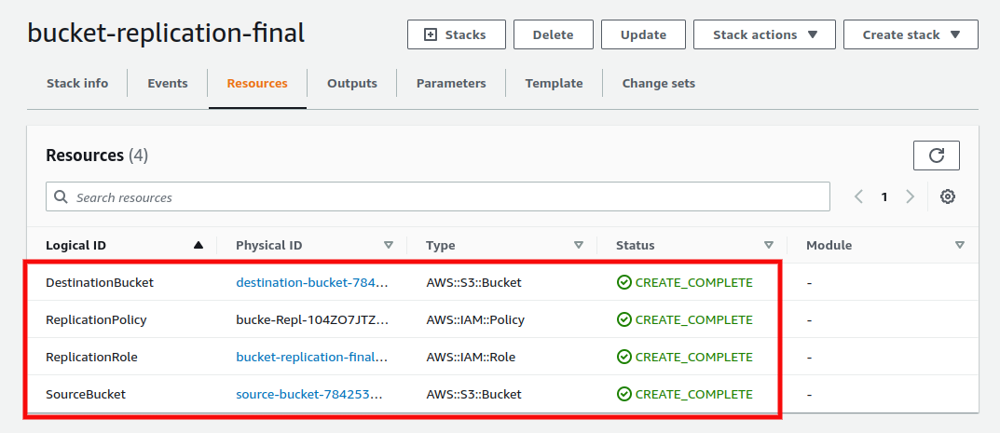

- Now we will test the deployment by uploading an object to the source bucket and see if it will be replicated in the destination bucket. We will then delete the object and see if it will also be deleted in the destination bucket. Navigate to the source bucket and click **Upload**;

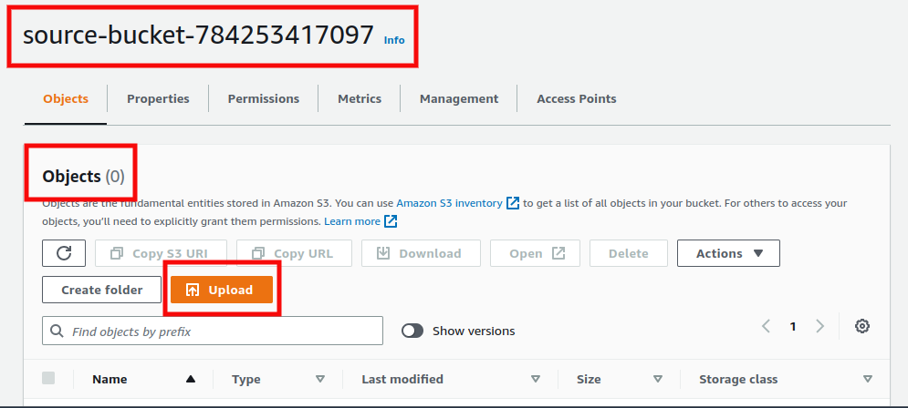

- Click **Add files** then select the file you want to upload;

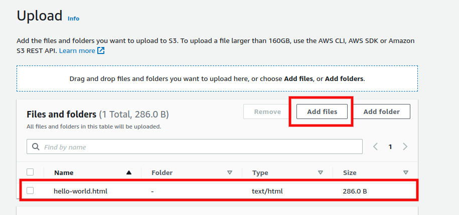

- After adding the file, click **Upload**;

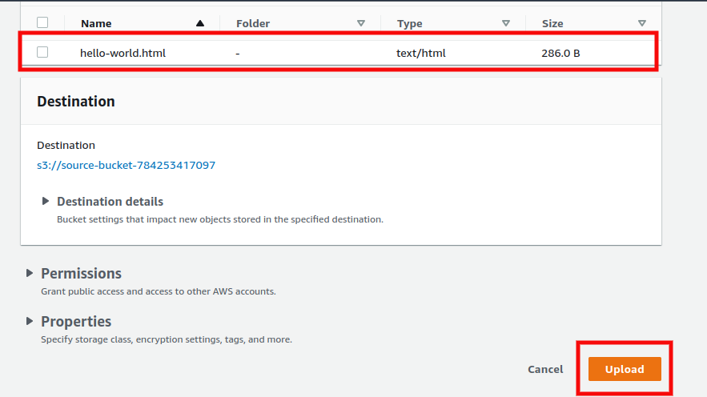

- Notice the file has now been uploaded to the source bucket;

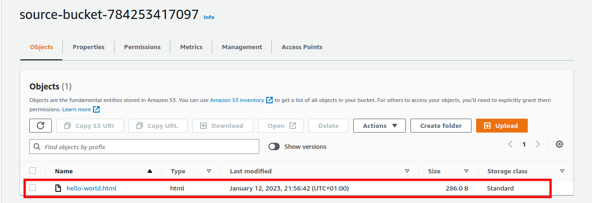

- Navigate to the destination bucket and you should notice that the file has also been replicated in the destination bucket which confirms that the configuration was successful;

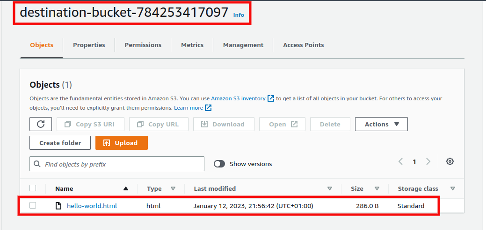

- Now navigate back to the source bucket and click **Delete**;

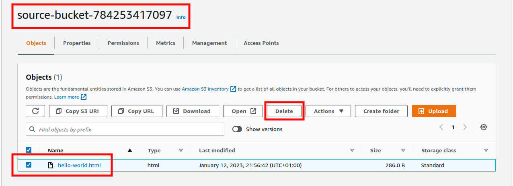

- Enter `delete` to confirm deletion and click **Delete objects**;

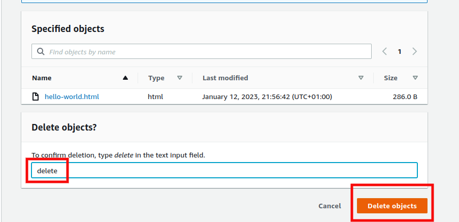

- Navigate to the destination bucket and confirm if the replicated file has also been deleted;

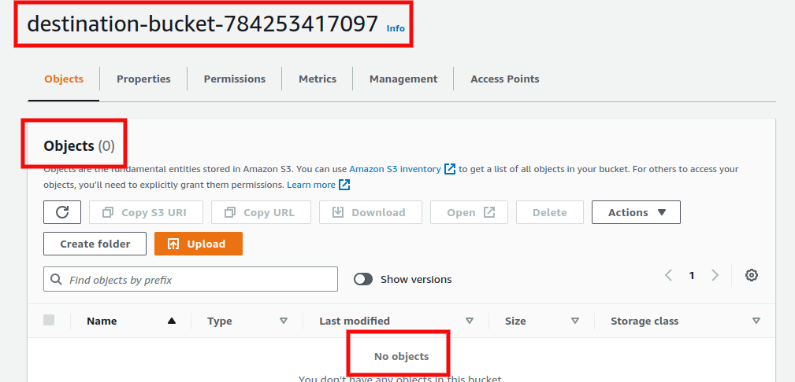
