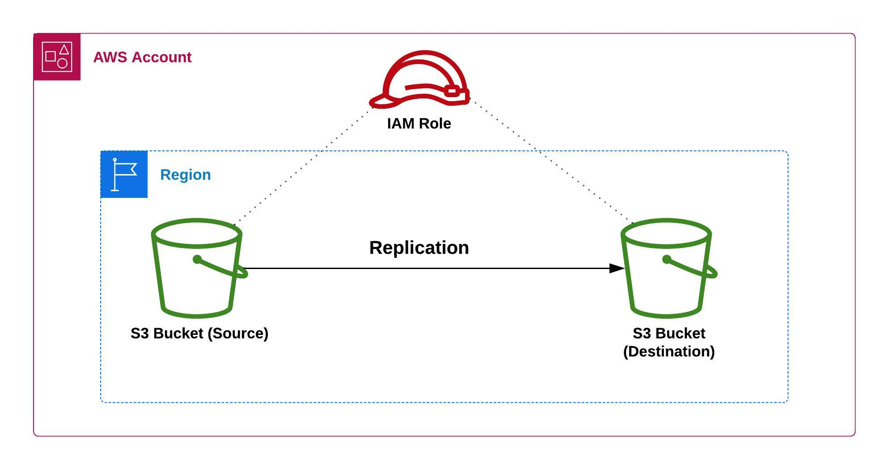
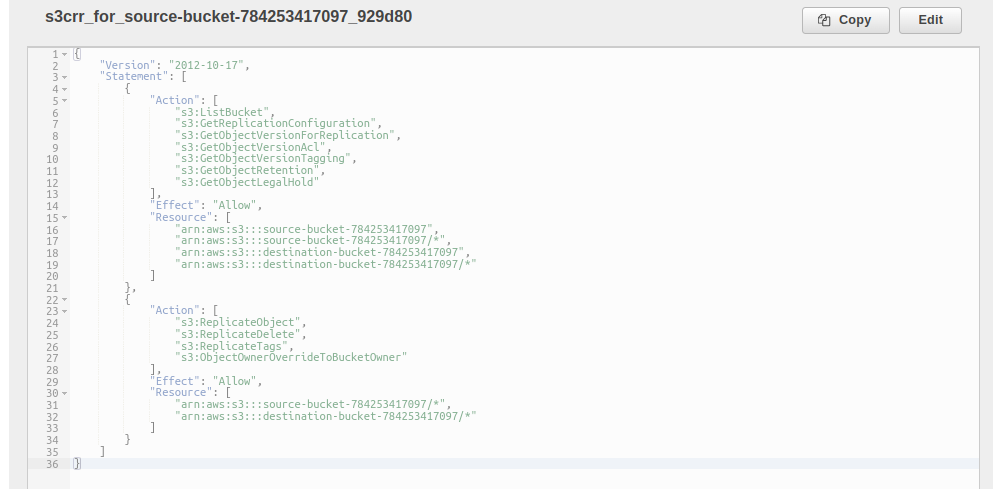

### How to Enable Replication on Two S3 Buckets in the Same AWS Account

#### Overview

Amazon S3 Replication is a feature that enables automatic and asynchronous replication of objects within an S3 bucket or to another S3 bucket or an S3 bucket that belongs to another AWS account. This feature is useful for a variety of purposes, such as creating backups, enabling disaster recovery, or distributing content to multiple locations.

There are two types of replication:

1. Same-Region Replication (SRR): this type of replication allows users to replicate objects within the same AWS region.

2. Cross-Region Replication (CRR): this type of replication enables users to replicate data to a different region, which can be useful for disaster recovery or compliance with regional data residency requirements.

In both cases, replication is done asynchronously, meaning that changes made to the source bucket may not be immediately reflected in the destination bucket. This ensures that the replication process does not interfere with the performance of the source bucket.

One of the key benefits of S3 Replication is that it allows you to create multiple copies of your data in different locations. This can help protect against data loss due to hardware failure, natural disasters, or other unforeseen events. Additionally, having multiple copies of your data can also help improve the performance and availability of your application by reducing the latency for users accessing the data from different locations.

Another benefit of S3 Replication is that it allows you to maintain compliance with different regulatory standards. By replicating your data to different regions, you can ensure that your data is stored in compliance with the laws and regulations of each region.

Additionally, the replication process can be configured using the AWS Management Console, the AWS SDKs, or the AWS Command Line Interface (CLI). This makes it easy for users to set up and manage replication across their S3 buckets.

Overall, AWS S3 Replication is a powerful and flexible feature that can help organizations ensure the availability and durability of their data, regardless of location or circumstances.

To enable replication, you will need to create a replication rule in the source bucket that specifies which objects should be replicated and where they should be replicated to. The destination bucket must also have a proper IAM role configured to receive the replicated data.

S3 replication also provides options for data encryption, versioning and also Multi-Factor Authentication (MFA) Delete that enables additional level of security.

It's important to note that S3 replication only replicates new or updated objects, it doesn't replicate deletions. If deletion of an object needs to be replicated , it can be achieved via versioning in the source bucket.

#### Enterprise Use-case

An enterprise use case for Amazon S3 Replication would be for a media and entertainment company that needs to distribute large video files to multiple locations for streaming. The company could use S3 Object Replication to replicate individual video files to multiple S3 buckets in different regions. This would ensure that users in different regions have fast access to the company's video content regardless of their location, reducing the latency and improving the streaming experience.

For example, the company could replicate the video files from their primary S3 bucket in the US to other S3 buckets in Europe and Asia. This would ensure that users in Europe and Asia have fast access to the video files and would reduce the load on the primary S3 bucket in the US.

Additionally, the company could use S3 Bucket Replication to create a backup copy of their video files in a different region. This would ensure that the company has a backup copy of their video files in case of an outage or disaster in their primary region.

The company could also use the versioning feature of S3 replication to maintain historical versions of the video files, which could be useful for compliance purpose or for rolling back to a previous version of a video if necessary.

Cross-region replication feature could be used by the company to replicate their data across different regions and ensure that their data is available in multiple regions in the event of a disaster.

Overall, this use case demonstrates how S3 Replication can be used in a practical way to distribute large video files to multiple locations for streaming, while also creating backups and maintaining compliance with different regulatory standards.

#### Architectural Diagram

This architecture illustrates a source S3 bucket that is being replicated to a destination S3 bucket in the same region.

#### Topics Covered

Here is a list of topics that will be covered in this lab on Amazon S3 Replication:

1. How to create secure and private S3 buckets using CloudFormation.
2. How to create the appropriate IAM role and policy to attach to the S3 buckets to enable replication.
3. How to enable versioning and configure a replication rule on the S3 buckets created.

#### Enabling S3 Replication using the AWS Management Console:

- Step One - Create two buckets with policies that block all public access and versioning enabled. We will be using CloudFormation to this;

1.  First, create a paramters file. You can name the file `paramaters.json` and include the following script in the paramters file;

        [
          {
            "ParameterKey": "ID",
            "ParameterValue": "<your_name>"
          }
        ]

This creates a paramter called **ID** and assigns it the value **\<your_name>**. Kindly note that you need to replace **\<your_name>** with your actual name. This will be used in the creation of a unique S3 bucket name.

2.  Create a cloudformation configuration file. Name the config file `main.yml` and include the following script in the config file;

        ---
        AWSTemplateFormatVersion: "2010-09-09"
        Description: >
          Enabling Replication on two S3 buckets in the same AWS Account
        Parameters:
          ID:
            Description: your unique ID or name
            Type: String

This simply defines the AWS template format version, the description of the cloudformation stack and the parameters which will be referenced in the creation of resources in the cloudformation stack.

3.  Create a source bucket and enable versioning on it. The following code creates a source bucket named **source-bucket-${ID}**. Note that the **"\${ID}"** will be replaced by the name which you entered as the value of the **ID** parameter in your `parameter.json` file;

        Resources:
          SourceBucket:
            Type: AWS::S3::Bucket
            Properties:
              BucketName: "source-bucket-${ID}"
              VersioningConfiguration:
                Status: Enabled
              PublicAccessBlockConfiguration:
                BlockPublicAcls: true
                BlockPublicPolicy: true
                IgnorePublicAcls: true
                RestrictPublicBuckets: true;

This creates the source bucket with bucket versioning enabled and also blocks all public access to the bucket. Add the script to the `main.yml` file.

3.  Create a destination bucket and enable versioning on it. The following code creates a destination bucket named **destination-bucket-${ID}**;

        DestinationBucket:
          Type: AWS::S3::Bucket
          Properties:
            BucketName: "destination-bucket-${ID}"
            VersioningConfiguration:
              Status: Enabled
            PublicAccessBlockConfiguration:
              BlockPublicAcls: true
              BlockPublicPolicy: true
              IgnorePublicAcls: true
              RestrictPublicBuckets: true

This creates the destination bucket with bucket versioning enabled and also blocks all public access to the bucket. Add the script to the `main.yml` file.

- Step Two - Create a Replication Rule in the Source bucket with an IAM Role that Amazon S3 can assume to replicate objects on your behalf. First, click the **Name** of the Source bucket;

1. On the Source bucket's page, click the **Management** tab;

2. Under the **Management** tab, click **Create replication rule**;

3. Enter a **Replication rule name** and ensure the **Status** is set to **Enabled**;

4. The **Source bucket name** and **Source Region** will be preselected. Select the option **Apply to all objects in the bucket** under **Choose a rule scope**, so all items in the source bucket will be replicated to the destination bucket;

5. Under **Destination**, click **Browse S3**;

6. In the **Choose a bucket** window, select the destination bucket you created earlier and click **Choose path**. This is the bucket where you want to replicate objects to;

7. Under **IAM role**, select **Choose from existing IAM roles** and select **Create new role** from the IAM role drop-down list;

The image above shows the policy attached to the IAM role created.

8. For **Additional replication options**, select **Delete marker replication**. This ensures that objects deleted in the source bucket are also deleted in the destination bucket. However, you can leave it unchecked if you want to keep replicated objects in the destination bucket even after the objects have been deleted in the source bucket. Then click **Save**;

9. You can choose to replicate existing objects in the source bucket by selecting **Yes, replicate existing objects.** or choose not to by selecting **No, do not replicate existing objects.** and then click **Submit**;

10. At this point, you will notice the **Replication rule** and **IAM role** have been successfully configured in the **Source bucket**.

#### Enabling S3 Replication using the AWS CloudFormation:

1.  Create a source bucket and enable versioning on it. The following code creates a source bucket that blocks all public access;

        SourceBucket:
          Type: AWS::S3::Bucket
          Properties:
            BucketName: "source-bucket-${ID}"
            VersioningConfiguration:
              Status: Enabled
            PublicAccessBlockConfiguration:
              BlockPublicAcls: true
              BlockPublicPolicy: true
              IgnorePublicAcls: true
              RestrictPublicBuckets: true

2.  Create a destination bucket and enable versioning on it. The following code creates a destination bucket that blocks all public access;

        DestinationBucket:
          Type: AWS::S3::Bucket
          Properties:
            BucketName: "destination-bucket-${ID}"
            VersioningConfiguration:
              Status: Enabled
            PublicAccessBlockConfiguration:
              BlockPublicAcls: true
              BlockPublicPolicy: true
              IgnorePublicAcls: true
              RestrictPublicBuckets: true

3.  Create an IAM role. You specify this role in the replication configuration that you add to the source bucket later. Amazon S3 assumes this role to replicate objects on your behalf. The following code creates a role that grants Amazon S3 service principal permissions to assume the role;

        ReplicationRole:
          Type: "AWS::IAM::Role"
          Properties:
            AssumeRolePolicyDocument:
              Statement:
                - Action:
                    - "sts:AssumeRole"
                  Effect: Allow
                  Principal:
                    Service:
                      - s3.amazonaws.com

4.  Create a policy that grants permissions for S3 replication to the **ReplicationRole**;

        ReplicationPolicy:
          Type: 'AWS::IAM::Policy'
          Properties:
            PolicyDocument:
              Statement:
                - Action:
                    - 's3:GetReplicationConfiguration'
                    - 's3:ListBucket'
                  Effect: Allow
                  Resource:
                    - !Join
                      - ''
                      - - 'arn:aws:s3:::source-bucket-${ID}'
                - Action:
                    - 's3:GetObjectVersion'
                    - 's3:GetObjectVersionAcl'
                  Effect: Allow
                  Resource:
                    - !Join
                      - ''
                      - - 'arn:aws:s3:::source-bucket-${ID}/*'
                - Action:
                    - 's3:ReplicateObject'
                    - 's3:ReplicateDelete'
                  Effect: Allow
                  Resource:
                    - !Join
                      - ''
                      - - 'arn:aws:s3:::destination-bucket-${ID}/*'
            PolicyName: ReplicationPolicy
            Roles:
              - !Ref ReplicationRole

5.  Add replication configuration to the source bucket;

        ReplicationConfiguration:
          Role: !GetAtt "ReplicationRole.Arn"
          Rules:
            - Destination:
                Bucket: 'arn:aws:s3:::destination-bucket-${ID}'
                StorageClass: STANDARD
              Id: ReplicationConfig
              Prefix: ''
              Status: Enabled

The final cloudformation script should look like this;

        ---
        AWSTemplateFormatVersion: "2010-09-09"
        Description: >
          Enabling Replication on two S3 buckets in the same AWS Account
        Parameters:
          ID:
            Description: your unique ID or name
            Type: String
        Resources:
          SourceBucket:
            Type: AWS::S3::Bucket
            Properties:
              BucketName: "source-bucket-${ID}"
              VersioningConfiguration:
                Status: Enabled
              PublicAccessBlockConfiguration:
                BlockPublicAcls: true
                BlockPublicPolicy: true
                IgnorePublicAcls: true
                RestrictPublicBuckets: true
              ReplicationConfiguration:
                Role: !GetAtt "ReplicationRole.Arn"
                Rules:
                  - Destination:
                      Bucket: "arn:aws:s3:::destination-bucket-${ID}097"
                      StorageClass: STANDARD
                    Id: ReplicationConfig
                    Prefix: ""
                    Status: Enabled

          DestinationBucket:
            Type: AWS::S3::Bucket
            Properties:
              BucketName: "destination-bucket-${ID}"
              VersioningConfiguration:
                Status: Enabled
              PublicAccessBlockConfiguration:
                BlockPublicAcls: true
                BlockPublicPolicy: true
                IgnorePublicAcls: true
                RestrictPublicBuckets: true

          ReplicationPolicy:
            Type: "AWS::IAM::Policy"
            Properties:
              PolicyDocument:
                Statement:
                  - Action:
                      - "s3:GetReplicationConfiguration"
                      - "s3:ListBucket"
                    Effect: Allow
                    Resource:
                      - !Join
                        - ""
                        - - "arn:aws:s3:::source-bucket-${ID}"
                  - Action:
                      - "s3:GetObjectVersion"
                      - "s3:GetObjectVersionAcl"
                    Effect: Allow
                    Resource:
                      - !Join
                        - ""
                        - - "arn:aws:s3:::source-bucket-${ID}/*"
                  - Action:
                      - "s3:ReplicateObject"
                      - "s3:ReplicateDelete"
                    Effect: Allow
                    Resource:
                      - !Join
                        - ""
                        - - "arn:aws:s3:::destination-bucket-${ID}/*"
              PolicyName: ReplicationPolicy
              Roles:
                - !Ref ReplicationRole

          ReplicationRole:
            Type: "AWS::IAM::Role"
            Properties:
              AssumeRolePolicyDocument:
                Statement:
                  - Action:
                      - "sts:AssumeRole"
                    Effect: Allow
                    Principal:
                      Service:
                        - s3.amazonaws.com

5.  Execute the cloudformation script using the following command;

        aws cloudformation create-stack/update-stack
            --stack-name STACK_NAME
            --template-body FILE_NAME
            --parameters PARAMETER_NAME
            --capabilities CAPABILITY
            --region REGION

Note: Replace STACK_NAME with what you want to name the cloudformation stack, FILE_NAME with the name of the cloudformation config file, PARAMETER_NAME with the name of the parameter file, and REGION with the region you want to deploy your cloudformation stack in.

6. Head over to the AWS Management Console then navigate to the CloudFormation console and confirm that the script has been executed successfully. Click on **Resources**. This will display a list of the resources deployed based on what was declared in the Cloudformation script;

- Now we will test the deployment by uploading an object to the source bucket and see if it will be replicated in the destination bucket. We will then delete the object and see if it will also be deleted in the destination bucket. Navigate to the source bucket and click **Upload**;

- Click **Add files** then select the file you want to upload;

- After adding the file, click **Upload**;

- Notice the file has now been uploaded to the source bucket;

- Navigate to the destination bucket and you should notice that the file has also been replicated in the destination bucket which confirms that the configuration was successful;

- Now navigate back to the source bucket and click **Delete**;

- Enter `delete` to confirm deletion and click **Delete objects**;

- Navigate to the destination bucket and confirm if the replicated file has also been deleted;

#### Roles/Policies Required for completing the lab

This lab will require permissions to create, update and delete CloudFormation stacks, create S3 buckets, list all S3 buckets, create and update roles in IAM and also grants permissions to replicate objects and delete replicated objects from the source bucket, put, get and delete objects from the destination bucket.This IAM policy grants the required permissions;

    {
      "Version": "2012-10-17",
      "Statement": [
        {
          "Effect": "Allow",
          "Action": [
            "cloudformation:CreateStack",
            "cloudformation:UpdateStack",
            "cloudformation:DeleteStack",
            "s3:CreateBucket",
            "s3:ListAllMyBuckets"
          ],
          "Resource": "*"
        },
        {
          "Effect": "Allow",
          "Action": [
              "iam:CreateRole",
              "iam:PutRolePolicy",
              "s3:ReplicateObject",
              "s3:ReplicateDelete",
              "s3:PutObject",
              "s3:GetObject",
              "s3:DeleteObject"
          ],
          "Resource": ["arn:aws:s3:::source-bucket/*", "arn:aws:s3:::destination-bucket/*"]
        }
      ]
    }
